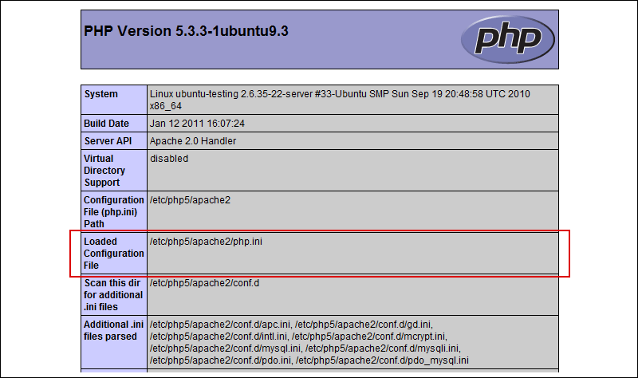

.. _dia_1:

Dia 1 - Introducción
====================

Tratando de seguir el camino que implantó en su momento el tutorial `Jobeet`_ para Symfony 1.x, el grupo de Symfony en español decidió realizar algo similar para Symfony 2. "Jobeet" fué una aplicación web dedicada a la oferta laboral. El tutorial estaba divididos en días, en los cuales se explicaba paso a paso como desarrollar la aplicación, tocando cada uno de los componentes vitales del framework, logrando así que su aprendizaje sea extremadamente sencillo. 

En esta oportunidad, se realizó una votación para elegir que tipo de aplicación web sería útil desarrollar esta vez. En primer lugar, por unos pocos votos, salió triunfador el tipo de aplicación "E-Commerce", seguido muy de cerca por el "Gestor de Proyectos", el cual tenía como intención seguir los pasos de Redmine, pero en PHP. 

Esta vez decidimos realizar una aplicación algo mas compleja por dos motivos. En primer lugar, el aprendizaje de un framework de la gama de Symfony 2 es mucho mas sencillo para el desarrollador si se logran tocar todos los componentes de una manera amena y clara. Pero también creemos que es importante lograr mostrar todas las posibilidades de cada componente, lo cual es muy dificil de lograr en un sitio sencillo, simplemente porque no es necesario. Además, una aplicación mas completa nos permite tocar también temas de última generación en la web, como lo son `HTML 5`_, `CSS3`_ o las denominadas "Rich Internet Applications" (`RIA`_). 

En segundo lugar, una aplicación compleja permite servir como base para desarrollar una gama mas amplia de aplicaciones de lo que se podría lograr con un sitio mas simple. La idea principal es lograr que puedas aprender todos los puntos vitales de Symfony 2. Sin embargo, creimos que sería bueno que esta aplicación también te sirviera como base para crear tus propias aplicaciones web, o que al menos de ella obtengas varios "Bundles" que puedan servir para tus desarrollos.

La esencia de este tutorial es la misma que la que tuvo "Jobeet" en su momento. Es decir, cada día esta planeado para que se lea y se desarrolle en una o dos horas. Cada día se van a tocar uno o dos temas principales, hasta llegar al último día, donde se verá la aplicación terminada.

Esperamos que disfrutes de leer este tutorial tanto como nosotros lo hemos hecho al escribirlo. Estás listo para empezar? Comencemos!

Requisitos previos
------------------

Antes de comenzar, necesitas verificar que tienes el entorno adecuado de desarrollo. Por esta razón vamos a dedicar este día a la configuración de tu entorno y a la resolución de los problemas típicos que pueden surgir en el camino.

Lo primero que tienes que verificar es que tengas instalado un servidor web (como Apache o IIS) con PHP en su versión, como mínimo, 5.3.2, aunque se recomienda tener la versión 5.3.3. También necesitarás una base de datos compatible con PDO, como podrían ser MySQL o PostgreSQL. En nuestro caso utilizaremos MySQL, pero puedes utilizar la base de datos que prefieras. Por último, será necesario que poseas instalado el software de control de versiones git. Si aún no posees alguno de estos componentes instalados en tu sistema, o no sabes bién de que manera hacerlo, no te preocupes! la sección que sigue se encarga justamente de explicarte, con todo detalle, como crear tu propio entorno de desarrollo.

Instalación
-----------

A continuación describiremos paso a paso como instalar estos componentes en diferentes sistemas operativos:

- `Linux (Ubuntu / Debian)`_
- `Macintosh`_
- `Windows`_

Linux (Ubuntu / Debian)
#######################

Si tienes Ubuntu, es muy probable que ya tengas instalado Apache 2, PHP y MySQL. Pero de todas formas vamos a mostrarte como instalar estos componentes desde cero.

Para empezar, realiza un upgrade completo de tu distribución. Abre la consola y tipea los siguientes comandos.

.. code-block:: php

    sudo apt-get update

.. code-block:: php

    sudo apt-get dist-upgrade

.. code-block:: php

    sudo apt-get upgrade

Una vez actualizada tu distribución, vamos a proceder a instalar el servidor web. En este caso, instalaremos Apache 2:

.. code-block:: php

    sudo apt-get install apache2

Si todo salió bien, al ingresar desde un navegador a la direccion ``http://<Direccion IP del Servidor>`` (por ejemplo: http://192.168.0.1 o http://localhost si el servidor web se encuentra en la máquina local) deberías poder ver este resultado:

.. image:: images/dia_1/instalacion_linux_ubuntu_apache_1.png
    :align: center

El paso siguiente será instalar PHP y algunas librerías extras que necesitaremos mas adelante. Para esto ejecutamos el siguiente comando:

.. code-block:: php

    sudo apt-get install php5 libapache2-mod-php5 php5-dev

Reiniciamos Apache para que tome los cambios:

.. code-block:: php

    sudo /etc/init.d/apache2 restart

Antes de continuar, vamos a probar si PHP fue instalado correctamente. Para esto vamos a crear un script que simplemente llame a la funcion phpinfo():

.. code-block:: php

    sudo nano /var/www/phpinfo.php

Una vez abierto tu editor preferido, añádele lo siguiente:

.. code-block:: php

    <?php
        phpinfo();

Finalmente accede desde tu navegador a la direccion ``http://<Direccion IP del Servidor>/phpinfo.php``. Por ejemplo: http://192.168.0.1/phpinfo.php o http://localhost/phpinfo.php si el servidor web se encuentra en la máquina local. Deberías ver algo similar a lo que muestra la siguiente imagen:

.. image:: images/dia_1/instalacion_linux_ubuntu_php_1.png
    :align: center

Con esto ya tienes tu servidor web configurado, funcionando con PHP. No olvides eliminar el archivo /var/www/phpinfo.php para no exponer información vital de tu configuración a otras personas.

Ahora el siguiente paso será instalar MySQL. Para ello, accede nuevamente a la consola y ejecuta este comando:

.. code-block:: php

    sudo apt-get install mysql-server

Una vez que termine de bajar e instalar los paquetes y sus dependencias correspondientes, te debería aparecer una pantalla para ingresar el password que deseas configurar para el usuario root, tal como te mostramos en la siguiente imagen:

.. image:: images/dia_1/instalacion_linux_ubuntu_mysql_1.png
    :align: center

Una vez terminada la instalación, vamos a verificar que se instaló correctamente. Ingresa el siguiente comando para ingresar en la consola de MySQL:

.. code-block:: php

    mysql -u root -p

Luego ingresa el password que configuraste para el usuario root en el paso anterior. Acto seguido, debería aparecerte algo parecido a lo siguiente:

.. code-block:: php

    gadrian@ubuntu-testing:~$ mysql -u root -p
    Enter password:
    Welcome to the MySQL monitor.  Commands end with ; or \g.
    Your MySQL connection id is 42
    Server version: 5.1.49-1ubuntu8.1 (Ubuntu)

    Copyright (c) 2000, 2010, Oracle and/or its affiliates. All rights reserved.
    This software comes with ABSOLUTELY NO WARRANTY. This is free software,
    and you are welcome to modify and redistribute it under the GPL v2 license

    Type 'help;' or '\h' for help. Type '\c' to clear the current input statement.

    mysql>

Para salir de la consola, tipea el comando "exit" o aprieta CTRL + C.

Hay una configuración mas que deberías hacer en caso de que desees que otras PC's se conecten a tu base de datos. Si solo necesitas utilizarla localmente, este paso es opcional. Pero en caso contrario, tienes que editar el archivo my.cnf. En ubuntu tiene la siguiente ubicación:

.. code-block:: php

    sudo nano /etc/mysql/my.cnf

Busca la siguiente linea y reemplaza la IP 127.0.0.1 por la IP que tengas configurada en la red:

.. code-block:: php

    bind-address = 127.0.0.1

Obviamente tendrás que configurar una IP estática para que esto funcione correctamente.

El próximo paso será instalar phpMyAdmin. Una herramienta muy conocida y extremadamente útil para la administración de bases de datos MySQL, sin tener que ingresar a la consola y ejecutar comandos manualmente. Para ello, deberás abrir nuevamente una terminal y ejecutar el siguiente comando:

.. code-block:: php

    sudo apt-get install libapache2-mod-auth-mysql php5-mysql phpmyadmin

La siguiente pantalla te aparecera para seleccionar que servidor web se configurará para phpMyAdmin:

.. image:: images/dia_1/instalacion_linux_ubuntu_phpmyadmin_1.png
    :align: center

Selecciona Apache 2. Luego te preguntará si deseas configurar la base de datos de phpMyAdmin con dbconfig-common:

.. image:: images/dia_1/instalacion_linux_ubuntu_phpmyadmin_2.png
    :align: center

Seleccionas que si. Luego te preguntará por la contraseña del usuario de administración de tu base de datos. Colocas la contraseña de tu usuario root. Finalmente te preguntará por otra contraseña de aplicación para phpMyAdmin. Puedes colocar tu propia contraseña o dejar el campo en blanco para que phpMyAdmin lo genere automáticamente.

Vamos a probar si phpMyAdmin esta funcionando. Accede desde tu navegador a la direccion ``http://<Direccion IP del Servidor>/phpmyadmin``. Por ejemplo: http://192.168.0.1/>/phpmyadmin o http://localhost/>/phpmyadmin si el servidor web se encuentra en la máquina local. Deberías ver algo similar a lo que muestra la siguiente imagen:

Simplemente ingresa la contraseña que configuraste para phpMyAdmin y ya estarás listo para utilizarlo. Felicitaciones, ya tienes tu paquete LAMP instalado!

Ahora necesitamos instalar `Git`_, el sistema de control de versiones que utilizaremos con nuestra aplicación. Para instalarlo solo tienes que ejecutar el siguiente comando en tu terminal:

.. code-block:: php

    sudo apt-get install git-core

Si todavía no utilizas `Git`_, no te preocupes. Siempre que vayamos a utilizarlo, te mostraremos que comandos ejecutar y explicaremos brevemente el porque de su uso. De todos modos te recomendamos leer el excelente libro de Git: `Pro Git`_.

Ya estamos cerca de terminar! El siguiente paso es instalar la extensión intl para PHP. Esta extensión es necesaria actualmente para que funcionen los validators de Symfony 2. Para instalarla, simplemente ejecuta este comando en tu terminal:

.. code-block:: php

    sudo apt-get install php5-intl

Lo que vamos a hacer ahora es instalar `MongoDB`_ y su soporte para PHP. Este paso es necesario ya que algunas entidades de nuestro modelo serán persistidas en MongoDB. El primer paso será ejecutar los siguientes comandos:

.. code-block:: php

	sudo apt-get install mongodb

.. code-block:: php

	sudo pecl install mongo

Lo único que resta entonces es activar la extensión desde tu archivo php.ini. Agrega la siguiente linea:

.. code-block:: php

	extension=mongo.so

Si todo salió bien, al reiniciar Apache ya debería estar funcionando la extensión de MongoDB para PHP.

Uno de los últimos pasos será instalar XDebug, que no solo nos ayudará a la hora de realizar el debug de nuestras aplicaciones, sino que también será realmente útil al momento de realizar un code coverage de nuestros unit tests.

Para instalar esta extensión, ejecuta el siguiente comando:

.. code-block:: php

	sudo pecl install xdebug

Una vez instalada la extension, deberás agregar la siguiente linea a tu fichero php.ini:

.. code-block:: php

	zend_extension=xdebug.so

En algunas ocasiones PHP lanza un error indicando que el archivo xdebug.so no fue encontrado. Si tienes este problema, ejecuta el siguiente comando:

.. code-block:: php

	find / -name xdebug.so

Si en los resultados aparece una linea como la siguiente:

.. code-block:: php

	/usr/lib/php5/20090626/xdebug.so

Entonces en tu archivo php.ini deberás agregar:

.. code-block:: php

	zend_extension=/usr/lib/php5/20090626/xdebug.so

Al reiniciar Apache, ya deberías tener la extensión activa. Recuerda que puedes verificar las extensiones instaladas simplemente viendo el resultado de la funcion phpinfo().

Con esto ya tienes tu entorno de desarrollo configurado correctamente para correr aplicaciones que utilicen Symfony 2. Un paso opcional, aunque altamente recomendable, es la instalacion de un acelerador de PHP llamado `APC`_, el cual mejora la performance de ejecución de scripts de PHP sustancialmente. Para instalarlo, ejecuta en tu terminal el comando que mostramos a continuación:

.. code-block:: php

    sudo apt-get install php-apc

Con esto finaliza la instalación y configuración de tu entorno de desarrollo en Ubuntu o distribuciones basadas en Debian.

Macintosh
#########

Si eres usuario de Mac probablemente tengas ya un entorno de desarrollo con Apache 2.1 y PHP 5.2 pero como es conocido symfony2 esta hecho para PHP 5.3 y para no tener complicaciones vamos a instalar `MAMP`_

		
Allí pulsamos el botón "Download Now" una ves terminada las descarga el sistema montará automáticamente la imagen DMG descargada y copiamos la carpeta MAMP a nuestra carpeta de aplicaciones:

		
Abrimos la carpeta MAMP y ejecutamos la aplicación MAMP:

		 
Es posible que te solicite tu contraseña:

Una vez la aplicación abierta:

Y automáticamente lanzara la web de inicio mostrando que la instalación fue exitosa:

.. image:: images/dia_1/instalacion_mac_local_mamp_web.png
  	:align: center

Ahora solo debemos configurar la versión de PHP, para ello pulsamos el botón preferencias y alli seleccionamos la versión de PHP que nos interesa 5.3.2:

Pulsamos ok, reiniciamos los servidores. Para finalizar en nuestra carpeta de usuario creamos un archivo .profile si es que este no existe y allí añadimos la siguiente información

.. code-block:: php

    ;export PATH=/Applications/MAMP/bin/php5.3/bin:/Applications/MAMP/Library/bin:$PATH
		                                                        
Guardamos y cerramos el archivo, esto nos permite ejecutar PHP desde la consola sin problemas. 

Listo, ya tenemos nuestro entorno para desarrollador con Symfony2.

Windows
#######

Existen diversos paquetes para Windows que incluyen un servidor web (Apache 2 en este caso), PHP, MySQL y otras herramientas muy útiles para el desarrollo. Uno de estos fantásticos paquetes es `WAMP`_.

Baja el último paquete estable e instalalo. La instalación es muy sencilla y con las opciones por defecto suele bastar. Al finalizar la instalación de WAMP, ya tendrás instalado Apache, PHP, MySQL y herramientas como phpMyAdmin. Antes de proseguir, sin embargo, debemos hacer un pequeño cambio en el archivo ``php.ini``. La instalación de WAMP, por defecto, trae la extensión intl desactivada. Symfony 2 actualmente requiere de esta extensión para los validators. Para activarla, lo unico que debemos hacer es buscar esta linea:

.. code-block:: php

    ;extension=php_intl.dll

Y borrarle el punto y coma (que transforma la linea en comentario). Luego reiniciar Apache y listo, ya tendremos la extensión activada.

Otra extensión que es muy recomendable instalar es APC. Para instalarla en Windows, deberas bajarla de `este sitio`_. En mi caso, teniendo Windows 7 de 32 bits y el paquete WAMP instalado, la extensión que bajé es:

.. code-block:: php

    php_apc-3.1.5-5.3-vc6-x86.zip

Dentro del zip solo viene una DLL. En el caso de WAMP, solo basta con colocarla en el directorio bin/php/php5.3.x/ext. Luego editas el archivo ``php.ini``. Vas a la parte de extensiones y agregas la siguiente linea:

.. code-block:: php

    extension=php_apc.dll

Con reiniciar el servidor web ya deberías tener la extensión habilitada. Puedes comprobarlo, como siempre, ejecutando la funcion ``phpinfo()``.

Otro paso que es recomendable hacer es setear en el PATH la ruta hacia el ejecutable de PHP, para poder utilizarlo desde la consola. Para realizar este paso, deberás ingresar al Panel de Control, luego elegir "Sistema". En Windows XP debes ir a la solapa "Avanzadas", mientras que en Windows 7 debes seleccionar primero "Opciones avanzadas de sistema". Una vez en esta sección, debes hacer click en "Variables de Entorno". Busca en la parte de abajo la variable PATH, y agrega el path al ejecutable de PHP. En mi caso es C:\\Wamp\\bin\\php\\php5.3.5\\. No olvides de cerrar y volver a abrir cualquier consola que tengas abierta para que tenga efecto el cambio.

El paso siguiente será instalar git. Para Windows, la implementación mas conocida es `msysgit`_:

Las descargas están en la columna derecha. Una vez descargado el instalador, te aparecerán varias opciones para elegir, pero generalmente es conveniente dejar las opciones por defecto. Una vez instalado, si elegiste tener bash como consola, al iniciar git te aparecerá lo siguiente:

Con esto finalizamos la instalación para Windows.

Configuración de PHP
--------------------

Teniendo todo instalado, lo que necesitamos hacer ahora es configurar PHP. El archivo a configurar se llama `php.ini`. Hay que tener en cuenta que en algunos casos se tiene un único `php.ini`, mientras que en otros casos hay dos: Uno que se utiliza cuando ejecutas scripts desde la consola (CLI), y otro cuando ejecutas scripts desde el navegador. Una manera de saber cual se está utilizando es ejecutar phpinfo(). En la siguiente imagen te mostramos donde se informa la ubicación del php.ini utilizado por PHP: 

Nosotros vamos a utilizar Ubuntu como ejemplo para configurar PHP. Las modificaciones que realizaremos son válidas para cualquier sistema operativo. Recuerda asegurarte que el `php.ini` que estás modificando es el que efectivamente usa PHP para ejecutar tus scripts.

Habiendo encontrado los archivos de configuración, vamos a proceder a editarlos. En nuestro caso, los archivos se encuentran en las siguientes rutas:

.. code-block:: php

    sudo nano /etc/php5/cli/php.ini

Y:

.. code-block:: php

    sudo nano /etc/php5/apache2/php.ini

En primer lugar, deberás asignar un timezone correspondiente a tu zona. En mi caso, es el siguiente:

.. code-block:: php

    date.timezone = America/Argentina/Buenos_Aires

Aquí tienes `la lista de timezones soportadas por PHP`_.

Luego, asegurate de que las siguientes opciones estén configuradas de la siguiente forma en el/los archivo/s `php.ini`:

.. code-block:: php

    short_open_tag = Off

.. code-block:: php

    display_errors = Off

.. code-block:: php

    log_errors = On

.. code-block:: php

    error_log = path/al/archivo_de_log_de_errores_php

.. code-block:: php

    register_globals = Off

.. code-block:: php

    magic_quotes_gpc = Off

.. code-block:: php

    session.auto_start = 0

El limite de memoria para los scripts ejecutados desde el CLI debería ser mas alto que para los scripts ejecutados desde el navegador, básicamente porque suelen ejecutar tareas mas pesadas, tales como backups del sistema, limpieza, tests, etc. Por esta razon vamos a asignarle 512M a la opción `memory_limit` del CLI:

.. code-block:: php

    memory_limit = 512M

Mientras que al php.ini de Apache vamos a asignarle 64M:

.. code-block:: php

    memory_limit = 64M

Listo! completamos la configuración de PHP. No fue dificil, no?

Comienzo del proyecto
---------------------

Para comenzar nuestro proyecto, vamos a descargar el sandbox de Symfony 2, el cual ya nos provee de una estructura base de directorios y archivos para poder comenzar a desarrollar nuestra aplicación. Para ello, primero tenemos que ir a la carpeta publica de nuestro servidor web. En nuestro caso es `www`:

.. code-block:: php

    cd /var/www

El siguiente paso es clonar el repositorio del sandbox de symfony 2, lo cual vendría a ser como un `checkout` para los que utilizan SVN:

Completar.

.. _la lista de timezones soportadas por PHP: http://php.net/manual/en/timezones.php
.. _HTML 5: http://es.wikipedia.org/wiki/HTML_5
.. _CSS3: http://www.css3.info/
.. _Pro Git: http://progit.org/
.. _Git: http://git-scm.com/
.. _APC: http://php.net/manual/en/book.apc.php
.. _RIA: http://es.wikipedia.org/wiki/Rich_Internet_Applications
.. _Jobeet: http://www.symfony-project.org/jobeet/1_4/Doctrine/en/
.. _WAMP: http://www.wampserver.com/
.. _este sitio: http://downloads.php.net/pierre/
.. _msysgit: http://code.google.com/p/msysgit/
.. _MAMP: http://www.mamp.info/en/index.html
.. _MongoDB: http://www.mongodb.org/
