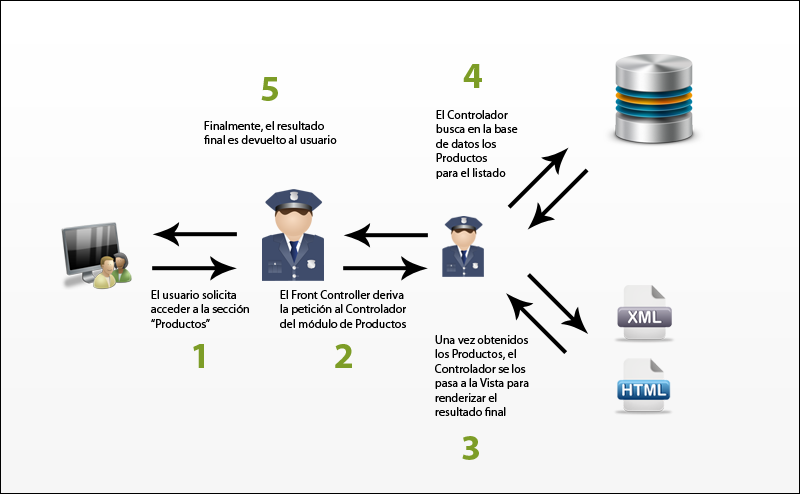

.. _dia_2:

Dia 2 - Conceptos Generales
===========================

El desarrollo web ha crecido enormemente en la última decada. Este crecimiento trajo a la par una serie de conceptos y patrones de diseño que lograron simplificar nuestro trabajo de una forma muy significativa. Symfony 2 utiliza muchos de estos conceptos y patrones, los cuales permiten hacernos la vida mucho mas sencilla a la hora de programar nuestras aplicaciones web. Pero no todo es color de rosas. Tantos conceptos nuevos pueden despistar al desarrollador que recién empieza a conocer los frameworks MVC. Por eso vamos a realizar este día una introducción básica a toda esta nueva era del desarrollo web, para que nadie se quede afuera. Comencemos!

El concepto Model - View - Controller (MVC)
-------------------------------------------

Creo que no hay sitio de desarrollo web que no haya nombrado el termino "MVC". Pero.. que es esto? como puede ayudarme? Nada mejor para entender este concepto que utilizar un ejemplo. 

Supongamos que queremos hacer un sitio con 5 secciones: Pagina Principal, Productos, Servicios, Sobre Nosotros y Contacto. Un ejemplo de estructura que no utilice scripting y resuelva nuestro requerimiento podría ser el siguiente:

.. code-block:: php

	/css
		styles.css
	/images
	/js
		scripts.js
	index.html
	products.html
	services.html
	about.html
	contact.html

Nuestro sitio consta de 5 archivos HTML, los cuales contienen repetidos, como mínimo, la sección HEAD con los includes de archivos CSS y JS, el encabezado del sitio, el pié de página y la barra de navegación. Esto sin contar que no tenemos acceso a ninguna base de datos para guardar nuestros productos o servicios, con lo cual deberíamos mantener nuestros listados y fichas técnicas a mano desde el HTML. Una pesadilla para el usuario común, de la cual vinieron a salvarnos lenguajes como PHP.

Utilizando un lenguaje como PHP, podemos reducir la repetición de código, y utilizar una base de datos para mantener nuestros Productos y Servicios. La estructura siguiente quedaría asi:

.. code-block:: php

	/css
		styles.css
	/images
	/js
		scripts.js
	/templates
		header.php
		footer.php
		navbar.php
	/system
		common.php
		database.php
	index.php
	products.php
	services.php
	about.php
	contact.php

El archivo header.php contiene toda la primera parte de nuestro HTML. Ahora tenemos la parte de inclusión de JS y CSS en un solo lugar, junto al encabezado del sitio. En el archivo footer.php tenemos el pié de página con links a nuestras secciones y la información del copyright. Finalmente, en el archivo navbar.php tenemos nuestra barra de navegación.

Sin dudas ha sido un avance. Pero definitivamente contiene muchas fallas aún. Veamos como quedaría, por ejemplo, nuestro archivo index.php utilizando esta estructura:

.. code-block:: html

	<?php
		require_once( 'system/common.php' );
		require_once( 'system/database.php' );
		
		// Lógica necesaria para cargar desde la base de datos la información a mostrarse en la Pagina Principal
	?>
	<html>
	<head>
		<!-- CSS -->
		<link ref="stylesheet" type="text/css" href="css/styles.css" />
		
		<!-- JS -->
		
	</head>
	<body>
	

		<?php require_once( 'templates/header.php' ) ?>

		<?php require_once( 'templates/navbar.php' ); ?>
		
		

			<?php foreach ( $productos as $producto ): ?>
				

					<h3><?php echo $producto[ 'title' ] ?></h3>
					" alt="<?php echo $producto[ 'title' ] ?>" />
					
<?php echo $producto[ 'description' ] ?>

				

			<?php endforeach ?>
		

		
		<?php require_once( 'templates/footer.php' ); ?>
	

	</body>
	</html>

En primer lugar, vemos que, al abrir el archivo, lo primero que nos encontramos es con código PHP con la lógica necesaria para obtener de la base de datos los elementos que vamos a mostrar en la Pagina Principal. Esto no es la práctica ideal por varias razones. Supongamos que tenemos un diseñador web que trabaja con nuestras templates. El no tiene porqué ver toda la lógica necesaria para obtener un listado de productos. El solo está interesado en la estructura HTML, en los CSS y en recibir un array de Productos para poder mostrarlos con el menor código PHP posible (en este caso, con un simple foreach). Pero este no es el único problema. Todo el layout (la estructura general del sitio) también se encuentra en todos los scripts: index.php, products.php, servicis.php.. con lo cual, si queremos cambiar la estructura general del sitio, o si queremos reutilizar en otra un bloque presente en la Pagina Principal, deberíamos duplicar código. 
Por último, también existe otro problema que salta a la vista. Tenemos varios puntos de entrada a nuestra aplicación. Por ejemplo, el usuario puede ingresar por el script index.php, o products.php, o contact.php. Lo ideal es tener un único punto de entrada que se encargue de derivar la petición del usuario al/los scripts que correspondan. Este único script receptor de todas las peticiones se denomina Front Controller. Si no conoces este concepto, no te preocupes. Luego lo explicaremos en detalle.

Sabiendo todo esto, queda claro que necesitamos cambiar el enfoque. Nuestro próximo paso entonces será cambiar la estructura de nuestra aplicación a la siguiente:

.. code-block:: php

	/css
		styles.css
	/images
	/js
		scripts.js
	/modules
		/layouts
			/layout.php
		/products
			/controller
				product.php
			/model
				product.php
			/view
				list.php
				details.php
		/services
			/controller
				service.php
			/model
				service.php
			/view
				list.php
				details.php
		/homepage
			/controller
				homepage.php
			/model
				homepage.php
			/view
				content.php
		/about
			/controller
				about.php
			/model
				about.php
			/view
				content.php
		/contact
			/controller
				contact.php
			/view
				form.php
	/common
		constants.php
		database.php
	index.php

Gran cambio en la estructura, no? no dejes que te asuste. En los siguientes puntos explicaremos el sentido de este cambio.

Que es un Controlador? (Controller)
###################################

Un Controlador se encarga básicamente de recibir una petición de un usuario y devolver un resultado. En el medio de este proceso generalmente se ejecuta la denominada lógica de aplicación. En el caso de una aplicación web, la lógica de aplicación incluye tareas como llamar al Modelo indicado (mas sobre este punto mas tarde) y obtener la información que se necesita para mostrar al usuario. Por ejemplo, en una sección de Productos, esta información podria tener la forma de un array de Productos. Luego de obtener la información del Modelo, el Controlador necesita pasarsela a la Vista (nuevamente, mas sobre este punto luego) para poder generarla. La Vista se refiere simplemente a los templates, los cuales pueden ser HTML, XML o cualquier formato que se necesite devolver al usuario. Al terminarse la generación de la Vista, el Controlador devuelve al usuario el resultado final. Este es el resultado que termina siendo visualizado por el usuario en su navegador.

En esta aplicación tenemos un Controlador que funciona de una manera bastante particular. El archivo index.php funciona en realidad como un Controlador especial, denominado "Front Controller". Su principal objetivo es que pasen todas las peticiones del usuario por el, y derivarlas al Controlador que corresponda. Este es el único punto de entrada que el usuario posee a nuestra aplicación. Es decir, solo puede acceder desde su navegador al archivo "index.php", ya que el acceso al resto de los scripts se encuentra bloqueado a cualquier dispositivo que no acceda desde localhost, por cuestiones de seguridad. Esto nos da muchas ventajas, siendo la principal la de tener un único punto de entrada, pudiendo agregarle cualquier lógica global que requiera nuestra aplicación.

Para tener una mejor idea de como funcionaria un Front Controller muy básico, vamos a mostrarte el contenido del archivo index.php en nuestra supuesta aplicación:

.. code-block:: php

	<?php
		require_once( __DIR__'/common/constants.php' );
		
		// En este punto podemos inyectar cualquier lógica necesaria que necesitemos en forma 
		// global para nuestra aplicación.
		
		// Si no se especifica ninguna seccion en la URL, accedemos a la Homepage por defecto
		$seccion = isset( $_GET[ 'seccion' ] ) $_GET[ 'seccion' ] : 'homepage';
		
		switch ( $seccion )
		{
			case 'homepage':
				require_once( MODULES_DIR.'/homepage/controller/homepage.php' );
				
				break;
			case 'products':
				require_once( MODULES_DIR.'/products/controller/products.php' );
				
				break;
			case 'services':
				require_once( MODULES_DIR.'/services/controller/services.php' );
				
				break;
			case 'about':
				require_once( MODULES_DIR.'/about/controller/about.php' );
				
				break;
			case 'contact':
				require_once( MODULES_DIR.'/contact/controller/contact.php' );
				
				break;
			default:
				require_once( MODULES_DIR.'/homepage/controller/homepage.php' );
				
				break;
		}

Suponiendo que el usuario ingresó a la sección de Productos, el Front Controller derivaria la petición al controlador de Productos. En el caso de nuestra simple aplicación, si el usuario ingresa a la URL: **index.php?seccion=products**, entonces nuestro Front Controller automáticamente incluiria el script ubicado en `products/controller/products.php`, el cual contiene al Controlador encargado de gestionar las peticiones dirigidas a la sección Productos. Veamos el contenido de nuestro Controlador `products.php`:

.. code-block:: php

	<?php
		// Incluimos al Modelo y las Vistas del módulo de Productos
		require_once( MODULES_DIR.'/products/model/products.php' );
		require_once( MODULES_DIR.'/products/view/products.php' );
		
		// Obtenemos la lista de Productos desde la Base de Datos
		$productos = getProducts();
		
		// Generamos la vista del listado de Productos, pasandole la información obtenida del Modelo
		$view = generateViewOfListOfProducts( $productos );
		
		echo $view;

La simplicidad del ejemplo es extrema. Pero lo importante es mostrar qué significa un Controlador. En este caso vemos que del Modelo obtenemos una lista de Productos con la función `getProducts()`. El paso siguiente es generar la template que verá finalmente el usuario, pasandole la lista de Productos generada anteriormente. Las ventajas del patrón MVC empiezan a notarse lentamente. Cada capa de este patrón tiene responsabilidades bien definidas. El Modelo en este caso se encarga de obtener Productos desde una base de datos. Encapsulando esta lógica en su propia capa y separandola del HTML permite que la reutilicemos en otras secciones y, porque no, en otros sitios tambien. Lo mismo sucede con las templates. Al separar lo más posible al HTML de la lógica de la aplicación nos permite tener templates mas claros para los diseñadores web que no tienen porque conocer el lenguaje PHP. 

Las ventajas mencionadas anteriormente se harán mas notorias al revisar el código del Modelo y de la Vista. A continuación, el Modelo.

El Modelo (Model)
#################

Siguiendo con nuestra aplicación de ejemplo, vamos a mostrarte el contenido del Modelo de Productos, presente en el archivo `modules/products/model/products.php`:

.. code-block:: php

	<?php
		// Nos da acceso a $databaseHandler
		require_once( COMMON_DIR.'/database.php' );
		
		function getProducts()
		{
			$sql 		= 'SELECT products.id, products.title, products.description, products.image FROM products ORDER BY products.title ASC';
			$statement	= $databaseHandler->prepare( $sql );
			$statement->execute();
			
			return $statement->fetchAll();
		}

Ignoramos todo tipo de control de errores en el ejemplo para simplificarlo al máximo y poder mostrar lo importante. En este caso, vemos que el Modelo solo contiene una función encargada de obtener el listado de Productos de la base de datos, devolviendo un array de Productos listo para ser utilizado en otra parte de la aplicación.

Un Modelo, entonces, se encarga de manejar la persistencia de los datos de determinada entidad (en este caso, el Producto) en una base de datos, o utilizando cualquier metodo de persistencia de datos (por ejemplo, podría ser un XML). En el Modelo también se imponen las reglas de negocio que cada entidad requiera. Por ejemplo, a la hora de insertar un Producto, podríamos forzar a que el Producto tenga siempre un precio de venta mayor a su costo, lanzando un error en caso contrario. Encapsulando esta lógica en el Modelo, nos permite reutilizarlo en otras aplicaciones, y facilitar también su mantenimiento.

En nuestros ejemplos no hemos utilizado programación orientada a objetos porque hubiese complicado los ejemplos, y porque sabemos que muchos desarrolladores que no vengan de utilizar frameworks o de programar con objetos tendrán mas fácil la dificil tarea de migrar de la programación clásica de sitios web a las prácticas que impone el patrón MVC, utilizado por Symfony 2.

La Vista (View)
###############

La Vista, en su definición mas sencilla, es simplemente un conjunto de Templates. En el caso de nuestro módulo de Productos, la Vista contiene las templates necesarias para mostrar todo lo relacionado al módulo de Productos. Partiendo de esta definición, en el módulo de Productos podríamos tener una template para la lista de Productos, otra para la ficha técnica de un Producto individual y otra para un bloque mostrando los Productos destacados en todas las secciones.

No existe una única forma de generar el template final que verá el usuario. Por ejemplo, Twig (el engine de templates utilizado por defecto en Symfony 2), utiliza el patrón "Decorator" para renderizar las templates. La mejor manera de entender que significa esto es ver un ejemplo.

Es muy probable que, si ya has desarrollado un sitio web en PHP, hayas visto algo similar a esto:

.. code-block:: php

	<html>
	<head>
		<!-- CSS y JS -->
	</head>
	<body>
		

			<?php require_once( 'templates/header.php' ); ?>
			
			<?php require_once( 'templates/navbar.php' ); ?>
			
			<!-- Contenido de la Sección -->
			<?php require_once( 'templates/products.php' ); ?>
			<!-- Fin del contenido de la sección -->
			
			<?php require_once( 'templates/footer.php' ); ?>
		

	</body>
	</html>

Utilizando el patrón "Decorator" la misma página estaría planteada de la siguiente manera:

**Layout:**

.. code-block:: php

	<html>
	<head>
		<!-- CSS y JS -->
	</head>
	<body>
		

			
Header

			
			

				<a href="home">Homepage</a>
				<a href="products">Productos</a>
			

			
			<?php echo $content; ?>
			
			

				Información del Copyright
			

		

	</body>
	</html>

**Template de listado de Productos**:

.. code-block:: php

	<?php 
		// Función que emula el funcionamiento del patrón "Decorator" para nuestro ejemplo. En Twig existe una función similar
		// que realiza el mismo trabajo.
		extend( 'layout' );
	?>
	
	<?php foreach ( $products as $product ): ?>
		

			<h3><?php echo $product[ 'title' ] ?></h3>
			" alt="<?php echo $product[ 'title' ] ?>" />
			
<?php echo $product[ 'description' ] ?>

		

	<?php endforeach; ?>

La variable "$content" en el layout se encargaría de imprimir el contenido del template que extiende el layout en si. De una forma muy similar trabaja Symfony 2 con las templates. Cualquier template puede extender otra template. Esto lo encontraremos realmente útil a la hora de reutilizar templates en diferentes aplicaciones.

Conclusión
**********

El patrón MVC separa responsabilidades en 3 capas. El Controlador recibe la petición del usuario y llama al Modelo si es necesario para obtener la información a mostrar. Acto seguido, el Controlador le pasa dicha información a la template que se desea devolver. La Vista se encarga de mostrar como mejor le parezca a la información recibida. Al renderizarse la Vista, el Controlador la devuelve para que el usuario pueda verla. Separando de esta manera las responsabilidades, nos queda una aplicación bien estructurada, sin mezclar de mas codigo PHP en el medio del HTML de las templates. Un diseñador web puede trabajar sin problemas en una template a la par de un programador, mientras este último trabaja el Modelo y el Controlador. La aplicación de ejemplo que te hemos mostrado para explicar el patrón MVC es extremadamente simple, pero sirve para mostrarte las ventajas que puede presentar frente a la programación web tradicional. Para finalizar con este concepto, te presentamos un diagrama que resume el funcionamiento general del MVC:

Object Relational Mapping (ORM)
-------------------------------

A la hora de trabajar en nuestra aplicación, manejamos objetos casi en forma constante. Nuestro modelo de dominio va a estar estructurado en una red de objetos, siendo mas o menos grande dependiendo de la complejidad de la aplicación. En terminos simples, un ORM permite persistir este modelo basado en objetos en una base de datos relacional. El problema que resuelve un ORM es el "mapeo" de un objeto en una base de datos relacional (como las bases de datos SQL) el cual no puede ser realizado de forma directa. Esto sucede porque los objetos pueden estar formados tanto por valores escalares como por valores mas complejos (arrays, objetos), mientras que en una base de datos relacional un registro solo puede estar formado por valores escalares. 

La solución a este problema lo aporta el ORM, el cual "mapea" un objeto en una base de datos relacional al momento de la escritura, y crea objetos a partir del resultado obtenido de la base de datos al momento de la lectura. Para entender esto, nada mejor que un ejemplo. Supongamos que tenemos una clase denominada Persona:

.. code-block:: php

	<?php
		class Persona
		{
			protected $nombre;
			protected $apellido;
			protected $telefonos;
			
			public function __construct( $nombre, $apellido, array $telefonos )
			{
				$this->nombre 		= $nombre;
				$this->apellido		= $apellido;
				$this->telefonos	= $telefonos;
			}
		}

Para persistir estos datos en una base de datos relacional no podríamos utilizar una sola tabla, ya que la propiedad "telefonos" es en este caso un array de instancias de la clase "Telefono". El esquema que utilizaríamos para guardar una Persona en una base de datos MySQL sería el siguiente:

.. code-block:: php

	CREATE TABLE persona ( 
		id INT NOT NULL AUTO_INCREMENT PRIMARY KEY,
		nombre VARCHAR(255),
		apellido VARCHAR(255)
	);
	CREATE TABLE persona_telefonos (
		persona_id INT,
		tipo_telefono VARCHAR(255),
		telefono VARCHAR(255),
		FOREIGN KEY (persona_id) REFERENCES persona(id)
	);

Como puedes ver, la propiedad "$telefonos" de la clase "Persona" requiere una tabla adicional en la base de datos para guardar los teléfonos de cada persona. Un ORM se encarga de este mapeo, el cual puede llegar a ser muy complicado según el modelo de dominio de la aplicación.

Doctrine 2 es el ORM que utilizaremos. Nosotros explicaremos brevemente cada una de las funcionalidades que utilicemos al momento de necesitarlas. Sin embargo, es conveniente que leas su excelente `documentación`_ para conocerlo a fondo y poder exprimirlo al máximo.

Otros links que pueden resultarte útiles a la hora de comprender el funcionamiento interno de un ORM:

* `Patrones de persistencia de datos`_

Hasta mañana!
---------------------

Con esto concluimos este capítulo de introducción a conceptos importantes sumamente necesarios para poder continuar este tutorial. Mañana empezaremos a analizar y diagramar el proyecto Shopeet, incluyendo un diagrama con las entidades básicas que necesitaremos, una lista de requerimientos y las historias de usuario.

.. _documentación: http://www.doctrine-project.org/documentation
.. _Patrones de persistencia de datos: http://msdn.microsoft.com/en-us/magazine/dd569757.aspx