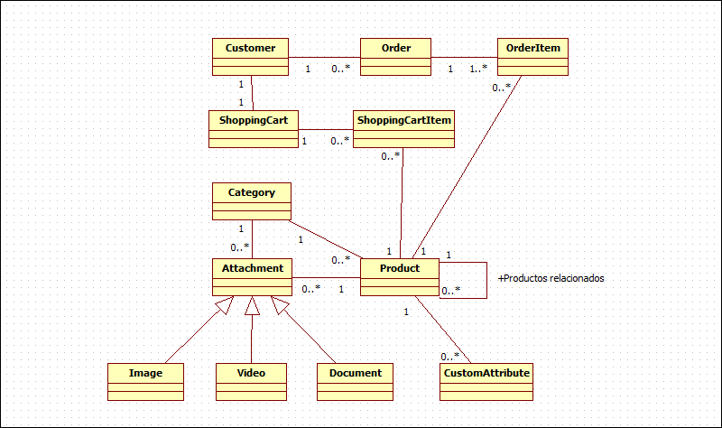

.. _dia_3:

Dia 3 - El Proyecto
===================

Cuando se desarrolla una aplicación, es muy importante dedicar tiempo al análisis y al diseño antes de empezar a escribir código. Siempre es mas facil borrar y volver a escribir un documento de requerimientos o un diagrama UML que cambiar, por ejemplo, el modelo de datos del modulo de Productos, y todos los modelos afectados por el cambio. Por esta razon vamos a dedicar este día a recorrer el análisis y parte del diseño de nuestra aplicación web.

Requerimientos iniciales
------------------------

Las características generales que nuestro Sistema de E-Commerce debe cumplir son las siguientes:

* La aplicación deberá estar conformada por bundles reutilizables, incluyendo un bundle de Productos, un bundle genérico de gateways de pago que pueda ser extendido, un bundle de un Shopping Cart, etc.
* El Backend deberá realizarse con el estilo de las aplicaciones `RIA`_, con manejo de ventanas, Grids y otros componentes avanzados, que le permitan al usuario realizar la carga de datos de forma rápida y eficiente. La interacción con el servidor deberá realizarse única y exclusivamente para la consulta y modificación de datos, enviando pedidos via JSON, sin recargar en ningún momento el layout del Backend.
* Permitirá la instalación y habilitación de diferentes templates para el Frontend.
* Será multilenguaje.
* Permitirá el uso de cualquier moneda y manejar los cambios de cotización.
* Deberá utilizar Listas de Control de Acceso (ACL) para moderar el uso del sistema a sus usuarios.
* El sistema deberá poseer acceso via Web Services a usuarios con privilegios de acceso al API, para realizar todo tipo de consultas y modificaciones, dependiendo de los permisos que tengan.
* Deberá poseer una arquitectura tal que permita el desarrollo e instalación de un nuevo gateway de pago de forma fácil y sin afectar al funcionamiento del Sistema, si ya fué implementado en Producción.
* Deberá poder actualizarse de una forma sencilla, y sin tener perdida de datos.
* Deberá poseer un sistema de Backup y Restore.
* El registro de usuarios deberá ser sencillo y rápido de completar.
* Deberá existir un método de retribución de contraseña.

Dentro de los requerimientos específicos en cada entidad, podríamos enumerar los siguientes:

Productos
#########

* Deberá existir la posibilidad de agregar atributos personalizados a un Producto, que puedan utilizarse también para la busqueda.
* Cada Producto podrá ser asignado a una o mas Categorías.
* Podrán crearse "Versiones" de Productos. Por ejemplo, un Producto A puede tener 3 versiones: en color blanco, negro y rojo.
* Podrán relacionarse Productos para poder mostrar una lista de Productos similares que puedan interesarle al comprador.
* Podrá configurarse si el Producto tendrá administración de stock o no.
* Se le podrán añadir Imagenes, Videos, Documentos y otro tipo de adjuntos.
* Podrán configurarse el costo, el precio y precios especiales por cliente o por rangos de fecha.

Categorías de Productos
#######################

* El arbol de categorías podrá llegar a cualquier nivel de profundidad.
* El arbol deberá implementarse con un diseño eficaz que tenga buen rendimiento de lectura (Nested Set o Closure Table, siendo preferible el último).
* Las categorías también podrán tener adjuntos.

Adjuntos
########

* Podrán ser imágenes, videos, documentos u otro tipo de adjuntos. Ciertos tipos de adjuntos deberán mostrarse de manera especial (las imágenes, por ejemplo, se mostrarán en una galería. Los videos en una galería diferente. Etc.).

[COMPLETAR]

Diagrama UML de Entidades
-------------------------

A continuación te presentamos un diagrama UML que muestra la relación entre las entidades mas importantes de nuestro Sistema:

[COMPLETAR]

.. _RIA: http://es.wikipedia.org/wiki/Rich_Internet_Applications